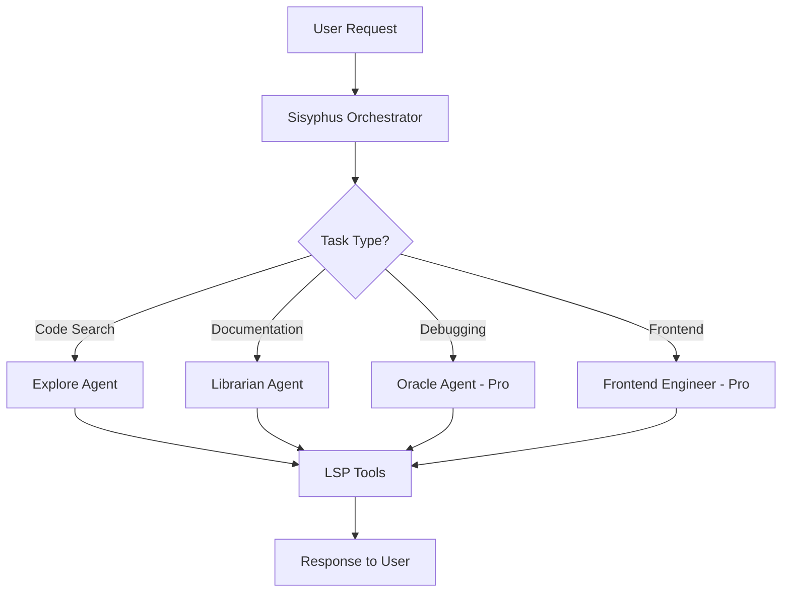

# 🚀 OmO User Guide - Oh My OpenCode for Antigravity

> **Multi-Agent AI Orchestration meets Google Antigravity**
> 
> Zero configuration. Maximum productivity. Built for developers who ship.

## 📖 Table of Contents

- [What is OmO?](#what-is-omo)
- [Installation](#installation)
- [Quick Start](#quick-start)
- [Core Features](#core-features)
- [Agent System](#agent-system)
- [Authentication & Tiers](#authentication--tiers)
- [Configuration](#configuration)
- [Common Workflows](#common-workflows)
- [Commands Reference](#commands-reference)
- [Troubleshooting](#troubleshooting)
- [Tips & Best Practices](#tips--best-practices)
- [FAQ](#faq)

---

## What is OmO?

**Oh My OpenCode (OmO)** is a powerful VS Code extension that brings multi-agent AI orchestration to Google Antigravity. Think of it as having a team of specialized AI developers working together on your codebase.

### Why OmO?

✅ **Zero Configuration** - Works out of the box, no complex setup  
✅ **Intelligent Agents** - Multiple AI specialists collaborating on tasks  
✅ **Deep Code Understanding** - LSP integration for precise refactoring  
✅ **Subscription-Aware** - Automatic tier detection and feature unlocking  
✅ **Privacy-First** - Your code stays local, only prompts go to AI  

---

## Installation

### Method 1: From VSIX (Current)

```bash
# Navigate to the extension directory
cd /home/frappe/antigravity-omo-extension

# Rebuild (if needed)
npm run build

# Install in Antigravity
antigravity --install-extension antigravity-omo-0.3.2.vsix --force
```

### Method 2: VS Code Marketplace (Coming Soon)

```bash
ext install antigravity-omo
```

### Verify Installation

1. Reload your VS Code window: `Ctrl+Shift+P` → "Developer: Reload Window"
2. Open Command Palette: `Ctrl+Shift+P`
3. Type "OmO" - you should see available commands
4. Check status bar - you should see the OmO icon

---

## Quick Start

### 1️⃣ First Launch

After installation, OmO automatically:
- Detects your subscription tier (Free/Pro/Enterprise)
- Enables appropriate agents
- Configures LSP for your project
- Initializes logging system

### 2️⃣ Your First Command

Open Command Palette (`Ctrl+Shift+P`) and try:

```
OmO: Show Status
```

This shows:
- ✅ Active subscription tier
- ✅ Enabled agents
- ✅ Authentication method
- ✅ Available models

### 3️⃣ Enable Authentication (Optional)

For **Pro features**, authenticate with Google:

```
OmO: Login with Google
```

This automatically:
- Detects your Antigravity Google account
- Upgrades you to Pro tier (if eligible)
- Unlocks premium models and agents

### 4️⃣ Start Using Agents

Simply chat with Antigravity's AI! OmO enhances the experience by:
- Providing specialized agents for different tasks
- Using LSP tools for accurate code navigation
- Maintaining context across conversations

---

## Core Features

### 🤖 Multi-Agent System

OmO includes specialized AI agents, each with unique capabilities:

#### **Sisyphus** (Orchestrator) - *Always Available*
- **Role**: Main task coordinator and delegator
- **Best For**: Breaking down complex tasks
- **Usage**: Default agent, works automatically
- **Example**: "Implement user authentication" → Sisyphus delegates to specialists

#### **Explore** (Code Search) - *Free Tier*
- **Role**: Fast codebase exploration and search
- **Best For**: Finding code patterns, understanding structure
- **Usage**: Automatic when searching codebase
- **Example**: "Where is the API client defined?"

#### **Librarian** (Documentation) - *Free Tier*
- **Role**: Documentation expert and knowledge manager
- **Best For**: Generating docs, explaining code
- **Usage**: Ask about documentation
- **Example**: "Document this function"

#### **Oracle** (Strategic Debugging) - *Pro Tier Only*
- **Role**: Advanced debugging and architecture analysis
- **Best For**: Complex bugs, performance issues
- **Requires**: Gemini API key or Google OAuth
- **Example**: "Why is this service crashing?"

#### **Frontend Engineer** - *Pro Tier Only*
- **Role**: UI/UX specialist
- **Best For**: React, Vue, Angular components
- **Example**: "Create a responsive navbar"

### 🔧 LSP Integration

OmO provides **deep code intelligence** through Language Server Protocol:

| Tool | Description | Use Case |
|------|-------------|----------|
| **Hover** | Get type info and docs | Understanding APIs |
| **Go to Definition** | Jump to symbol definition | Code navigation |
| **Find References** | Find all usages | Impact analysis |
| **Rename Symbol** | Smart rename across files | Safe refactoring |

**Auto-Configuration**: OmO automatically installs and configures language servers for your project.

### 📊 Long-Term Memory (Supermemory)

**Coming in v0.4.0** - Remember project context across sessions:

```
/supermemory-init  # Index your codebase
```

Features:
- Semantic search through past conversations
- Project knowledge persistence
- Smart context retrieval

### 🎯 Workflows

Create custom automation workflows:

```yaml
# .omo/workflows/deploy.yml
name: Deploy to Production
steps:
  - run: npm test
  - run: npm run build
  - run: git push origin main
```

Run with: `/ulw deploy`

---

## Agent System

### How Agents Work Together



### Agent Selection

OmO **automatically** selects the right agent based on:
1. **Task type** (search, debug, document)
2. **Subscription tier** (Free/Pro/Enterprise)
3. **Available resources** (API keys, models)

You don't need to manually choose agents!

---

## Authentication & Tiers

### Subscription Tiers

OmO adapts to your Antigravity subscription level:

#### 🆓 Free Tier

**What's Included:**
- ✅ Sisyphus, Explore, Librarian agents (2 concurrent)
- ✅ All LSP tools
- ✅ Gemini Flash & Grok Code models
- ✅ Basic workflows
- ✅ Core features

**Perfect For:** Individual developers, side projects

#### 💎 Pro Tier

**What's Included:**
- ✅ **All Free features**
- ✅ Oracle & Frontend Engineer agents (4 concurrent)
- ✅ Premium models (GPT-5, Claude Opus, Gemini Pro)
- ✅ Background task execution
- ✅ Advanced MCPs (Exa, Context7, grep.app)
- ✅ Supermemory & advanced workflows
- ✅ $50/month cost cap

**Perfect For:** Professional developers, teams

#### 🏢 Enterprise Tier

**What's Included:**
- ✅ **All Pro features**
- ✅ Unlimited concurrent agents
- ✅ Custom models and endpoints
- ✅ Advanced analytics
- ✅ Priority support

**Perfect For:** Large organizations, mission-critical projects

### Authentication Methods

OmO supports **two authentication methods**:

#### 1. Antigravity OAuth (Recommended)

**Automatic tier detection** via your Antigravity Google account:

```
Command: OmO: Login with Google
```

**Advantages:**
- ✅ Zero manual configuration
- ✅ Automatic Pro upgrade (if you have Antigravity Pro)
- ✅ Seamless token refresh
- ✅ Most secure method

**How it works:**
1. OmO detects your Antigravity Google login
2. Requests OAuth token with Gemini API scope
3. Automatically enables Pro features

#### 2. Manual API Keys

**Direct API key configuration** in settings:

```json
{
  "omo.apiKeys.gemini": "YOUR_GEMINI_API_KEY",
  "omo.apiKeys.opencodeZen": "YOUR_ZEN_API_KEY"
}
```

**When to use:**
- You prefer manual control
- Testing with multiple accounts
- Using different API keys per project

### Status Indicators

Check your authentication status in the **status bar**:

- 🆓 **Free** - Free tier, no authentication
- 🔐 **OAuth** - Authenticated via Google OAuth (Pro tier)
- 🔑 **API Key** - Using manual API key (Pro tier)

---

## Configuration

### Essential Settings

Open Settings: `Ctrl+,` → Search for "OmO"

#### Subscription & Authentication

```json
{
  // Subscription tier (auto-detected, but can override)
  "omo.tier": "free",  // "free" | "pro" | "enterprise"
  
  // Use Antigravity OAuth (recommended)
  "omo.auth.useAntigravityOAuth": true,
  
  // Show auth status in status bar
  "omo.auth.showAuthStatus": true,
  
  // Prefer manual API key over OAuth
  "omo.auth.preferManualApiKey": false
}
```

#### AI Models & Providers

```json
{
  // Enable OpenCode Zen (curated model gateway)
  "omo.zen.enabled": false,
  
  // Preferred Zen model
  "omo.zen.preferredModel": "claude-sonnet-4-5",
  
  // Gemini API key (for Oracle agent)
  "omo.apiKeys.gemini": "",
  
  // OpenCode Zen API key
  "omo.apiKeys.opencodeZen": ""
}
```

#### Agent Configuration

```json
{
  // Sisyphus - always enabled, main orchestrator
  "omo.agents.sisyphus.enabled": true,
  
  // Oracle - Pro tier only, requires Gemini API key
  "omo.agents.oracle.enabled": false,
  
  // Explore - Free tier, codebase search
  "omo.agents.explore.enabled": true,
  
  // Librarian - Free tier, documentation
  "omo.agents.librarian.enabled": true
}
```

#### Logging & Debugging

```json
{
  // Enable verbose logging
  "omo.logging.verbose": false,
  
  // Auto-show Output panel on startup
  "omo.logging.showOnStartup": false
}
```

**To view logs:**
1. Open Output panel: `Ctrl+Shift+U`
2. Select "OmO Extension" from dropdown
3. Enable verbose mode to see detailed logs

#### Features

```json
{
  // Enable LSP integration
  "omo.lsp.enabled": true,
  
  // Enable Supermemory (v0.4.0+)
  "omo.supermemory.enabled": true,
  
  // Enable workflows
  "omo.workflows.enabled": true,
  
  // Enable background tasks (Pro tier)
  "omo.enableBackgroundTasks": true,
  
  // Show status bar
  "omo.statusBar.enabled": true,
  "omo.statusBar.showMemoryCount": true
}
```

### AI Model Reference

#### Free Tier Models

| Model | Provider | Best For |
|-------|----------|----------|
| `gemini-flash` | Google | Fast responses, general coding |
| `grok-code` | xAI | Code generation, debugging |

#### Pro Tier Models (via Zen)

| Model | Provider | Best For |
|-------|----------|----------|
| `claude-sonnet-4-5` | Anthropic | Complex reasoning, refactoring |
| `claude-opus-4-5` | Anthropic | Highest quality, architecture |
| `gpt-5.2` | OpenAI | Cutting-edge capabilities |
| `gpt-5-codex` | OpenAI | Code generation |
| `gemini-3-pro` | Google | Multimodal, large context |

---

## Common Workflows

### 1. Code Refactoring

**Task**: Refactor a legacy function

```
You: "Refactor the getUserData function to use async/await"

OmO: 
1. Sisyphus delegates to Explore to find the function
2. LSP tools analyze dependencies
3. Suggests refactored code with impact analysis
4. Verifies no breaking changes
```

### 2. Bug Investigation (Pro)

**Task**: Debug a production error

```
You: "Why is the payment service timing out?"

OmO:
1. Oracle agent activates (Pro tier)
2. Uses LSP to trace API calls
3. Analyzes logs and error patterns
4. Provides root cause analysis
5. Suggests fixes with code examples
```

### 3. Documentation Generation

**Task**: Document an API endpoint

```
You: "Document the /api/users endpoint"

OmO:
1. Librarian agent activates
2. Explores code to understand behavior
3. Generates OpenAPI/JSDoc documentation
4. Adds usage examples
```

### 4. Feature Implementation

**Task**: Add dark mode toggle

```
You: "/ulw add dark mode toggle to settings page"

OmO:
1. Sisyphus breaks down task
2. Frontend Engineer creates UI component
3. Librarian adds documentation
4. Tests are suggested
5. Complete implementation ready for review
```

### 5. Codebase Exploration

**Task**: Understand unfamiliar code

```
You: "How does authentication work in this app?"

OmO:
1. Explore agent searches auth-related code
2. Maps authentication flow
3. Explains architecture
4. Points to key files and functions
```

---

## Commands Reference

Access via Command Palette (`Ctrl+Shift+P`) + type "OmO":

### Core Commands

| Command | Description | Shortcut |
|---------|-------------|----------|
| `OmO: Show Status` | Display extension status & tier info | - |
| `OmO: Show Configuration` | View current settings | - |
| `OmO: Hello World` | Test extension is working | - |

### Authentication Commands

| Command | Description | When to Use |
|---------|-------------|-------------|
| `OmO: Login with Google` | Authenticate via Antigravity OAuth | First time, or to upgrade to Pro |
| `OmO: Check Authentication` | Verify auth status | Troubleshooting |
| `OmO: Refresh OAuth Token` | Manually refresh token | Token expired |

### OpenCode Zen Commands

| Command | Description | Requires |
|---------|-------------|----------|
| `OmO: Configure OpenCode Zen` | Set up Zen API key | Zen account |
| `OmO: Test Zen Connection` | Verify Zen connectivity | Zen configured |
| `OmO: List Zen Models` | Show available Zen models | Zen configured |

### Memory Commands (v0.4.0+)

| Command | Description |
|---------|-------------|
| `OmO: Supermemory Init` | Index codebase for memory |

---

## Troubleshooting

### Output Channel Not Appearing

**Problem**: "OmO Extension" doesn't show in Output panel

**Solution:**
1. Reload window: `Ctrl+Shift+P` → "Developer: Reload Window"
2. Open Output panel: `Ctrl+Shift+U`
3. Check dropdown for "OmO Extension"
4. If still missing, check Developer Console (`F12`) for errors

### Oracle Agent Not Available

**Problem**: Oracle agent doesn't activate even on Pro tier

**Checklist:**
- ✅ Verify Pro tier: `OmO: Show Status`
- ✅ Check authentication: `OmO: Check Authentication`
- ✅ Ensure Gemini API key OR OAuth enabled
- ✅ Enable Oracle: Settings → `omo.agents.oracle.enabled: true`

### Authentication Failed

**Problem**: Google login not working

**Steps:**
1. Check you're logged into Antigravity with Google
2. Run: `OmO: Check Authentication`
3. Verify settings: `omo.auth.useAntigravityOAuth: true`
4. Try manual refresh: `OmO: Refresh OAuth Token`
5. Check Developer Console for OAuth errors

### Models Not Loading

**Problem**: AI responses fail or timeout

**Diagnosis:**
```
OmO: Show Configuration
```

**Common Causes:**
- ❌ API key not set (for Pro models)
- ❌ Rate limit exceeded
- ❌ Network connectivity issues
- ❌ Model not available for your tier

**Solutions:**
- Set API keys in settings
- Wait for rate limit reset
- Check internet connection
- Verify model availability: `OmO: List Zen Models`

### Verbose Logging

**Enable detailed logs** for debugging:

```json
{
  "omo.logging.verbose": true,
  "omo.logging.showOnStartup": true
}
```

Then check Output panel → "OmO Extension"

---

## Tips & Best Practices

### 🎯 Maximize Agent Effectiveness

1. **Be Specific**: "Refactor login.ts to use React hooks" > "Fix the login code"
2. **Provide Context**: Mention frameworks, libraries, constraints
3. **Use Natural Language**: OmO understands conversational requests
4. **Leverage Specialists**: Ask for docs → Librarian, debugging → Oracle

### 🚀 Performance Tips

1. **Free Tier**: Use Gemini Flash for fast iterations
2. **Pro Tier**: Use Claude Opus for complex architecture decisions
3. **Background Tasks**: Enable for long-running tasks (Pro)
4. **LSP Tools**: Pre-installed = faster code navigation

### 🔒 Privacy & Security

1. **Local First**: Code analysis happens locally via LSP
2. **Privacy Tags**: Configure sensitive keywords in `omo.supermemory.privacyTags`
3. **OAuth Tokens**: Stored encrypted in VS Code secure storage
4. **No Code Upload**: Only prompts and context sent to AI

### 💡 Workflow Optimization

1. **Create Custom Workflows**: Define common tasks in `.omo/workflows/`
2. **Use `/ulw` Commands**: Autonomous task execution
3. **Save Frequent Prompts**: Document common requests in project
4. **Check Logs**: Enable verbose logging during development

### 📊 Cost Management (Pro Tier)

1. **Monthly Cap**: OmO respects $50/month cost cap
2. **Model Selection**: Use cheaper models for simple tasks
3. **Monitor Usage**: Check status bar for request counts
4. **Rate Limits**: Auto-enforced to prevent overage

---

## FAQ

### Q: Is OmO free?

**A:** Yes! The free tier includes core features, 2 concurrent agents, and free models (Gemini Flash, Grok Code). Pro tier ($50/mo cap) unlocks premium models and specialized agents.

### Q: Do I need API keys?

**A:** Not for free tier! For Pro features, you can:
- Use Antigravity OAuth (automatic detection)
- Provide manual API keys (more control)

### Q: Where is my data stored?

**A:** Code stays local. Only prompts and selected context are sent to AI models. OAuth tokens are encrypted in VS Code secure storage.

### Q: Can I use OmO without Antigravity?

**A:** OmO is designed for Antigravity but can work in regular VS Code with manual API key configuration. Some features (auto-tier detection) require Antigravity.

### Q: How do I upgrade to Pro?

**A:** Two ways:
1. **Automatic**: Login with Google using Antigravity Pro account
2. **Manual**: Set `omo.tier: "pro"` + provide API keys

### Q: Which models should I use?

**Free Tier:**
- `gemini-flash` - Fast, general purpose
- `grok-code` - Code-specific tasks

**Pro Tier:**
- `claude-sonnet-4-5` - Best balance of quality/speed
- `claude-opus-4-5` - Highest quality
- `gpt-5-codex` - Code generation expert

### Q: Can I disable specific agents?

**A:** Yes! Configure in settings:
```json
{
  "omo.agents.explore.enabled": false,
  "omo.agents.librarian.enabled": false
}
```

Note: Sisyphus (orchestrator) is always enabled.

### Q: How does LSP integration work?

**A:** OmO automatically:
1. Detects your project languages
2. Installs required language servers
3. Provides LSP tools to agents
4. No manual configuration needed!

### Q: What's the difference between OmO and built-in Antigravity AI?

**A:** OmO **enhances** Antigravity with:
- Multiple specialized agents
- Deep LSP integration
- Long-term memory (coming soon)
- Custom workflows
- Advanced code understanding

Think of it as supercharging Antigravity's AI capabilities!

### Q: Is OmO open source?

**A:** Yes! OmO is MIT licensed. Contribute at:
https://github.com/yesitisthatis/antigravity-omo-extension

---

## 🎓 Learn More

- **GitHub**: [antigravity-omo-extension](https://github.com/yesitisthatis/antigravity-omo-extension)
- **Original Project**: [Oh My OpenCode](https://github.com/code-yeongyu/oh-my-opencode)
- **Google Antigravity**: [antigravity.google.com](https://antigravity.google.com)

---

## 🤝 Get Help

**Found a bug?** Open an issue on GitHub  
**Feature request?** Start a discussion  
**Need support?** Check the Output panel logs (`Ctrl+Shift+U` → "OmO Extension")

---

**Built with ❤️ for the Antigravity ecosystem**

*Last Updated: v0.3.2 - January 2026*
